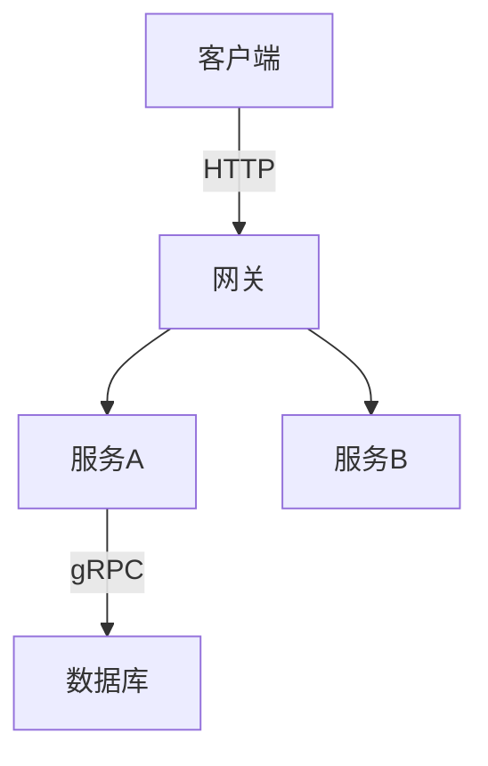

# 笔记写作规范

> 本文档定义 note 知识库的目录结构、README 模板、命名规范与图表约定，方便后续维护与扩展。

---

## 1. 目录结构规范

### 1.1 顶层模块（note/）

每个模块使用 `{nn}.{英文主题}/` 格式，`nn` 为两位数编号：

```
note/
├── 01.java/
├── 02.computer-basics/
├── 03.database/
├── ...
└── 13.split-hairs/
```

**规则：**
- 编号从 01 开始，两位数字 + 点号 + 英文小写 + 短横线
- 每个模块必须有 `README.md`
- 子目录使用 `{nn}-{英文主题}/` 编号前缀（如 `01-fundamentals/`、`02-language/`）

### 1.2 模块内子目录

```
note/03.database/
├── README.md              ← 模块入口（必须有）
├── 01-fundamentals/       ← 编号前缀子目录
│   └── README.md          ← 子模块入口
├── 02-sql/
│   ├── README.md
│   └── advanced-query/    ← 深层子目录（不再编号）
│       └── README.md
```

**规则：**
- 第一层子目录：编号前缀 `{nn}-{主题}/`
- 第二层及以下：直接英文主题，无需编号

---

## 2. 模块 README 模板（8-section index template）

每个模块 `README.md` 推荐使用以下 8 段式结构（09.front-end / 10.big-data 已采用）：

```markdown
# {N}、{模块中文名}

> 一句话定位（30 字以内）

---

## 1. 模块导航

| 序号 | 主题 | 核心内容 | 子 README |
|------|------|---------|-----------|
| 01 | [主题名](dir/) | 关键词1/关键词2 | [子入口](../README.md) |

### 1.1 学习路径
- **新人入门**：01 → 02 → 03
- **进阶方向**：...

---

## 2. 知识脉络


---

## 3. 速查表 / Cheat Sheet

| 概念 | 解释 | 典型场景 |
|------|------|---------|

---

## 4. 核心内容（按子模块展开）

每个子模块一个段落，包含：
- 核心原理
- 关键对比 / 选型
- 代码示例（如适用）

---

## 5. 最佳实践

---

## 6. 常见面试题

---

## 7. 相关章节

- 上游：[`模块名`](../README.md)
- 下游：[`模块名`](../README.md)
- 关联：[`模块名`](../README.md)

---

## 8. 开源参考（可选）

> 开源项目链接或说明
```

---

## 3. 命名规范

### 3.1 文件命名
- 使用小写英文 + 短横线：`bean-lifecycle.md`、`distributed-transaction/`
- README.md 统一大小写
- 不使用中文文件名
- **主模块 README 顶部加 HTML 注释 frontmatter**（与 12/13/14 一致）：
  - 主模块：`<!--module:number / slug / topic / audience / category / summary-->`
  - 文章型（12/13/14）：`<!--story/question/pm:...-->`
  - 详见 §10

### 3.2 图片命名（待迁移到 Mermaid）
- 历史遗留：`img.png`、`img_1.png` 等无意义命名
- **新规范：优先使用 Mermaid 图表**
- 若必须使用图片：`{主题}-{描述}.png`，如 `bean-lifecycle-flow.png`

### 3.3 Mermaid 图表规范

**推荐类型：**
| 场景 | 推荐图表类型 |
|------|------------|
| 流程 / 步骤 | `flowchart TD` / `flowchart LR` |
| 架构 / 模块关系 | `graph TB` / `graph LR` |
| 时序交互 | `sequenceDiagram` |
| ER 关系 | `erDiagram` |
| 状态转换 | `stateDiagram-v2` |
| 类结构 | `classDiagram` |

**示例：**


---

## 4. 相关章节规范

### 4.1 相对路径规则
```markdown
<!-- 同级模块 -->
[数据库](../README.md)

<!-- 子模块 -->
[MySQL](../README.md)

<!-- 父模块 -->
[返回总览](../README.md)

<!-- 跨模块 -->
[Spring 事务](../README.md)
```

### 4.2 13.split-hairs ↔ 主模块
每个 `13.split-hairs` 文章必须包含「深度阅读」链接指向主模块：
```markdown
## 相关章节
- 深度阅读：[`03.database/07-redis`](../README.md)
```

---

## 5. PNG → Mermaid 迁移清单

> **现状盘点（2026-07-01）**：仓库内有 **149 个 PNG 文件**，但仅 **7 篇 README** 引用了 **40 处 PNG 嵌入**——大量为 CONTRIBUTING §3.2 标定的"历史遗留 img.png / img_N.png 无意义命名"。
>
> 与 CONTRIBUTING 上一次盘点对比，实际引用 PNG **远少于 48 处**——之前的清单需要重整。

### 5.1 实际有 PNG 引用的文件（按目录）

| 文件 | PNG 引用数 | 适合 Mermaid？|
|------|----------|--------------|
| `07.workflow/apache-eventmesh/cloud-flow/README.md` | 3 | ✅ 架构 / 流程图，强烈建议改 |
| `07.workflow/process-engine/camunda/camunda-7/README.md` | 4 | ✅ Camunda 7 BPMN 流程图 |
| `07.workflow/process-engine/camunda/camunda-8/README.md` | 2 | ✅ Camunda 8 / Zeebe 架构图 |
| `11.ai/training/lesson1/README1.md` | 7 | ❌ Coze 教程 UI 截图 |
| `11.ai/training/lesson9/README2.md` | 21 | ❌ Dify 教程 UI 截图 |
| `11.ai/training/lesson9/README3.md` | 9 | ❌ Dify 教程 UI 截图 |
| `11.ai/training/lesson13/README1.md` | 1 | ❌ 占位截图 |

### 5.2 高优先级（适合 Mermaid）—— 共 9 处候选

1. `07.workflow/apache-eventmesh/cloud-flow/README.md` L1-L3：3 张架构图
2. `07.workflow/process-engine/camunda/camunda-7/README.md` L4-7：4 张 BPMN 流程图
3. `07.workflow/process-engine/camunda/camunda-8/README.md` L4-5：2 张 Zeebe 架构图

**执行方式**（推荐分批）：
- 看 PNG → 设计等价 Mermaid → 用 Mermaid 替换 `![img_N.png]` 段
- 同时清理无意义文件名，按 §3.2 命名规范改为 `{主题}-{描述}.png` 或直接删除

### 5.3 低优先级（UI 截图，保留 PNG）

`11.ai/training/lesson{1,9,13}/`：教程 UI 截图，**不建议**转 Mermaid，保留 PNG。
├── `lesson9/README2.md` 21 张
├── `lesson9/README3.md` 9 张
├── `lesson1/README1.md` 7 张
└── `lesson13/README1.md` 1 张
合计 38 张

### 5.4 状态（2026-07-01）

- [ ] camunda-7 (4 张) 未迁
- [ ] camunda-8 (2 张) 未迁
- [ ] apache-eventmesh/cloud-flow (3 张) 未迁
- [x] 11.ai/training/* 38 张保留（UI 截图）
- [ ] 其他 25 个文件目录中**有 PNG 文件但 README 未引用**——可考虑作为历史资料保留或清理
- [ ] 待执行 §2（孤儿 PNG 清理）：见实施计划 `docs/superpowers/plans/2026-07-01-note-optimization.md` Task 3

迁移建议：先做 5.2 的 9 张流程图 / 架构图，按"看图 → 写 Mermaid → 删除 PNG"三步走。

---

## 6. Commit 规范

使用 Conventional Commits 格式：

```
feat(note): 03.database - 新增云数据库子模块 README
feat(note): 14.project-management - 新增项目管理主模块（6 篇 PM）
fix(note): 09.front-end - 修正 3 处断链
refactor(note): 04.system-design - PNG→Mermaid 迁移
docs(note): 同步 CONTRIBUTING + scripts/validate.py
docs(note): 01.java - 标题'15 篇'→'32 篇'
chore(note): 13 主模块补文末回链
test(note): 14 主模块 0 ERR validate
```

类型：

| 类型 | 用途 |
|------|------|
| `feat` | 新增模块 / 文件 / 功能 |
| `fix` | 修 bug / 数字 / 错链 |
| `refactor` | 结构优化 / PNG → Mermaid |
| `docs` | 文档 / README / 规范同步 |
| `chore` | 元数据 / 格式调整 / 不动内容 |
| `test` | 测试用例 / 测试脚本 |

scope 规范：

- `note`：note 仓库统一 scope
- 细化（可选）：`note:12.story`、`note:13.split-hairs`、`note:14.project-management`

---

## 7. CI 检查

| 检查项 | 工具 | 触发条件 |
|--------|------|---------|
| 链接有效性 | `github-action-markdown-link-check` | Push/PR/Weekly |
| Stats 卡片更新 | `github-readme-stats-action` | 每日 00:00 |
| **主模块 README 规范** | 手动核对 3 必填项（见 §11） | 每次提交前自检 |

配置文件：`.mlc_config.json`（忽略 Gitee/GitHub 等外链）

---

## 8. 主模块 README 通用规范（人工自检）

每个主模块 README 必须满足 3 项必填规范（**手工核对**，不使用脚本）：

1. **文末回链**：必须含 `← [返回笔记目录]`，链接到 `../README.md`
2. **H1 标题不应带数字编号**：禁止 `# 五、`、`# 07`、`# 10` 等格式
3. **H1 后应有一句话定位**：blockquote 或一段简介（≤ 80 字）

> 📌 **历史说明**：早期仓库使用过 `note/scripts/validate.py` 自动校验上述 3 项，2026-07-01 已下线该脚本（与 `insert-frontmatter.py` / `png-to-mermaid.py` 一起删除），改为**手工核对**。理由：脚本覆盖率低（仅主 README 3 项），修改文件时手动更可控。

## 9. 各模块的细化规范（与通用校验互为补充）

某些子模块（12.story / 13.split-hairs / 14.project-management）有额外的细规范：

| 模块 | 细化规范 | 落实方式 |
|------|---------|---------|
| `12.story/` | STORY-FORMAT-SPEC.md（章节六段强制） | 作者按 SPEC 逐篇撰写 |
| `13.split-hairs/` | QUESTION-FORMAT-SPEC.md（## 引言强制） | 作者按 SPEC 逐篇撰写 |
| `14.project-management/` | 6 篇 PM 文章（业务决策实战） | 主 README + 6 子目录分工 |

**每个子模块的细化规范由作者按对应 SPEC.md 手工落实**。

## 10. frontmatter 规范（已全量落地 619 个 README）

为方便检索、交叉引用与未来工具生成，14 主模块 + 所有子 README 已统一使用 HTML 注释 frontmatter：

- **主模块（01-11）**：`<!--module: number / slug / topic / audience / category / summary-->`
- **子文章（12/13/14 + 11 子目录）**：`<!--module: parent / slug / type / category / summary-->`
- **12.story**：`<!--story:number / type / position / title / audience-->`
- **13.split-hairs**：`<!--question:id / topic / difficulty / frequency / scenario_type / tags-->`
- **14.project-management**：`<!--pm:topic / audience / category / summary-->`

> 📌 **2026-07-01 进展**：原缺失 frontmatter 的 45 个子 README（01.java/collection、01.java/concepts、01.java/version/function-history、06.spring、09.front-end、11.ai 等）已手工补全；当前 `note/` 下 **619 个 README 100% 具备 frontmatter**（0 缺失）。

---

## 11. 模块 README 自检表（2026-07-01 务实版）

不是硬性要求"8-section 模板"——每个模块有自己的领域特点。下面是 **3 必填 + 4 推荐**：

### 必填项（3 项，手工核对）

| # | 必填项 | 说明 |
|---|--------|------|
| 1 | H1 标题 | `# {N}、{中文模块名}` 或 `# {品牌名}`（如 12/13/14） |
| 2 | H1 后的一句话定位 | blockquote 或一段简介（≤ 80 字） |
| 3 | 文末"← [返回笔记目录]"回链 | 链接到 `../README.md` |

### 推荐项（4 项，手动对齐）

| # | 推荐项 | 说明 |
|---|--------|------|
| 4 | "## 目录导航 / 知识脉络" 类章节 | 让读者一眼看到全图 |
| 5 | "## 相关章节" 段 | 列上下游主模块链接 |
| 6 | "## 开源参考" 段 | 列本模块最相关的 3-10 个开源项目 |
| 7 | "## 学习路径" 段 | 给新人/进阶/老手各 1 条路径 |

### 2026-07-01 现状（实际 H2 节数）

| 模块 | H2 数 | 备注 |
|------|-------|------|
| 01.java | 6 | 标准 6 节式（无 emoji） |
| 02.computer-basics | 5 | 同 01 |
| 03.database | 6 | 加"## 🎯 高频面试题"特化 |
| 04.system-design | 7 | + "## 📂 模块导航 / 🆕 最近更新" |
| 05.tools | 5 | "7. 相关章节 / 8. 开源参考" 数字式 |
| 06.spring | 8 | emoji 风格 + 8-section 完整 |
| 07.workflow | 10 | + "BPMN 元素速查" + "真实落地案例" |
| 08.application-systems | 8+ | 业务链路 6 大类 + 集成模式 |
| 09.front-end | 10 | "1. / 2. / ..." 数字节 + "数据时效性" |
| 10.big-data | 10 | 同 09 |
| 11.ai | 6 | 标准 6 节式 |
| 12.story | 11 | 叙事系列（无统一模板） |
| 13.split-hairs | 7 | 自有 §1-§8 结构 |
| 14.project-management | 5 | 6-section + 决策清单 |

**结论**：**不强求统一**。每个模块按自身领域特点组织。

> 📌 **2026-07-01 现状修正**：02/03/04/08 四个主模块的 `## 开源参考` 段均已补齐，不再列入待补清单。

📌 **2026-07-01 起，新一轮 note-optimization 以 §12 "模块 README 标准结构" 为准**（14 个主模块逐个收敛到该模板）。本节（§11 务实版）保留作为历史参考。

---

## 12. 模块 README 标准结构

所有主模块 README 与子目录 README 必须遵循以下模板（详见 `docs/superpowers/specs/2026-07-01-note-optimization-design.md` §4）：

- 顶层模块 README：必须包含 frontmatter + 一句话导览 + 目录导航表格 + 适用人群（可选）+ 学习路径（可选）
- 二级子目录 README：必须包含 frontmatter + 1-2 句定位 + 核心内容表格 + 文末回链
- 三级文章页：按需补 frontmatter

frontmatter 写在 HTML 注释里，示例：

```markdown
<!--
module:
  parent: <父模块>
  slug: <路径>
  type: index|article|cheatsheet
  category: <分类>
  summary: <一句话>
-->
```

维护原则：所有变更手工逐文件修改，不使用脚本。

> 📌 **2026-07-01 起，新一轮 note-optimization（14 个主模块）以本节（§12）为权威标准**，§11 务实版仅作为历史参考；§2 8-section 模板继续保留为可选替代方案。
