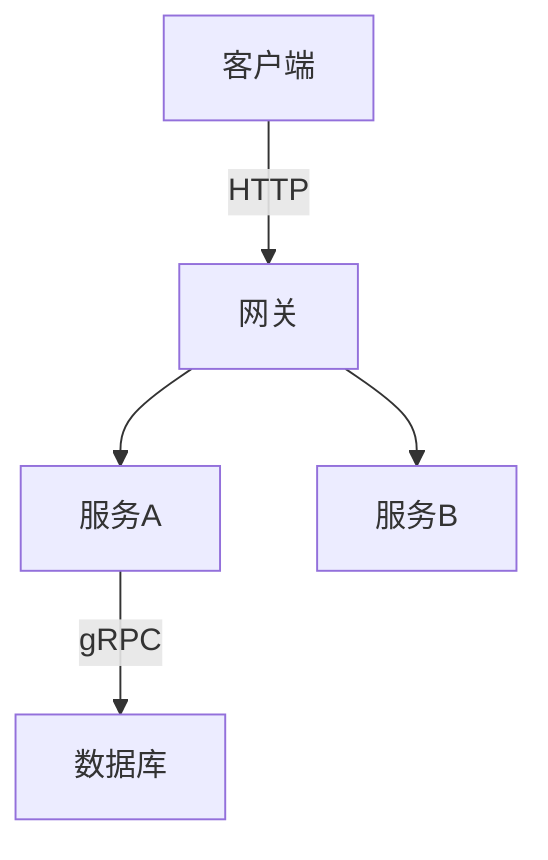

# 笔记写作规范

> 本文档定义 note 知识库的目录结构、README 模板、命名规范与图表约定，方便后续维护与扩展。

---

## 1. 目录结构规范

### 1.1 顶层模块（note/）

每个模块使用 `{nn}.{英文主题}/` 格式，`nn` 为两位数编号：

```
note/
├── 01.java/
├── 02.computer-basics/
├── 03.database/
├── ...
└── 13.split-hairs/
```

**规则：**
- 编号从 01 开始，两位数字 + 点号 + 英文小写 + 短横线
- 每个模块必须有 `README.md`
- 子目录使用 `{nn}-{英文主题}/` 编号前缀（如 `01-fundamentals/`、`02-language/`）

### 1.2 模块内子目录

```
note/03.database/
├── README.md              ← 模块入口（必须有）
├── 01-fundamentals/       ← 编号前缀子目录
│   └── README.md          ← 子模块入口
├── 02-sql/
│   ├── README.md
│   └── advanced-query/    ← 深层子目录（不再编号）
│       └── README.md
```

**规则：**
- 第一层子目录：编号前缀 `{nn}-{主题}/`
- 第二层及以下：直接英文主题，无需编号

---

## 2. 模块 README 模板（8-section index template）

每个模块 `README.md` 推荐使用以下 8 段式结构（09.front-end / 10.big-data 已采用）：

```markdown
# {N}、{模块中文名}

> 一句话定位（30 字以内）

---

## 1. 模块导航

| 序号 | 主题 | 核心内容 | 子 README |
|------|------|---------|-----------|
| 01 | [主题名](dir/) | 关键词1/关键词2 | [子入口](../README.md) |

### 1.1 学习路径
- **新人入门**：01 → 02 → 03
- **进阶方向**：...

---

## 2. 知识脉络


---

## 3. 速查表 / Cheat Sheet

| 概念 | 解释 | 典型场景 |
|------|------|---------|

---

## 4. 核心内容（按子模块展开）

每个子模块一个段落，包含：
- 核心原理
- 关键对比 / 选型
- 代码示例（如适用）

---

## 5. 最佳实践

---

## 6. 常见面试题

---

## 7. 相关章节

- 上游：[`模块名`](../README.md)
- 下游：[`模块名`](../README.md)
- 关联：[`模块名`](../README.md)

---

## 8. 开源参考（可选）

> 开源项目链接或说明
```

---

## 3. 命名规范

### 3.1 文件命名
- 使用小写英文 + 短横线：`bean-lifecycle.md`、`distributed-transaction/`
- README.md 统一大小写
- 不使用中文文件名

### 3.2 图片命名（待迁移到 Mermaid）
- 历史遗留：`img.png`、`img_1.png` 等无意义命名
- **新规范：优先使用 Mermaid 图表**
- 若必须使用图片：`{主题}-{描述}.png`，如 `bean-lifecycle-flow.png`

### 3.3 Mermaid 图表规范

**推荐类型：**
| 场景 | 推荐图表类型 |
|------|------------|
| 流程 / 步骤 | `flowchart TD` / `flowchart LR` |
| 架构 / 模块关系 | `graph TB` / `graph LR` |
| 时序交互 | `sequenceDiagram` |
| ER 关系 | `erDiagram` |
| 状态转换 | `stateDiagram-v2` |
| 类结构 | `classDiagram` |

**示例：**


---

## 4. 相关章节规范

### 4.1 相对路径规则
```markdown
<!-- 同级模块 -->
[数据库](../README.md)

<!-- 子模块 -->
[MySQL](../README.md)

<!-- 父模块 -->
[返回总览](../README.md)

<!-- 跨模块 -->
[Spring 事务](../README.md)
```

### 4.2 13.split-hairs ↔ 主模块
每个 `13.split-hairs` 文章必须包含「深度阅读」链接指向主模块：
```markdown
## 相关章节
- 深度阅读：[`03.database/07-redis`](../README.md)
```

---

## 5. PNG → Mermaid 迁移清单

> **现状盘点（2026-07-01）**：仓库内有 **149 个 PNG 文件**，但仅 **7 篇 README** 引用了 **40 处 PNG 嵌入**——大量为 CONTRIBUTING §3.2 标定的"历史遗留 img.png / img_N.png 无意义命名"。
>
> 与 CONTRIBUTING 上一次盘点对比，实际引用 PNG **远少于 48 处**——之前的清单需要重整。

### 5.1 实际有 PNG 引用的文件（按目录）

| 文件 | PNG 引用数 | 适合 Mermaid？|
|------|----------|--------------|
| `07.workflow/apache-eventmesh/cloud-flow/README.md` | 3 | ✅ 架构 / 流程图，强烈建议改 |
| `07.workflow/process-engine/camunda/camunda-7/README.md` | 4 | ✅ Camunda 7 BPMN 流程图 |
| `07.workflow/process-engine/camunda/camunda-8/README.md` | 2 | ✅ Camunda 8 / Zeebe 架构图 |
| `11.ai/training/lesson1/README1.md` | 7 | ❌ Coze 教程 UI 截图 |
| `11.ai/training/lesson9/README2.md` | 21 | ❌ Dify 教程 UI 截图 |
| `11.ai/training/lesson9/README3.md` | 9 | ❌ Dify 教程 UI 截图 |
| `11.ai/training/lesson13/README1.md` | 1 | ❌ 占位截图 |

### 5.2 高优先级（适合 Mermaid）—— 共 9 处候选

1. `07.workflow/apache-eventmesh/cloud-flow/README.md` L1-L3：3 张架构图
2. `07.workflow/process-engine/camunda/camunda-7/README.md` L4-7：4 张 BPMN 流程图
3. `07.workflow/process-engine/camunda/camunda-8/README.md` L4-5：2 张 Zeebe 架构图

**执行方式**（推荐分批）：
- 看 PNG → 设计等价 Mermaid → 用 Mermaid 替换 `![img_N.png]` 段
- 同时清理无意义文件名，按 §3.2 命名规范改为 `{主题}-{描述}.png` 或直接删除

### 5.3 低优先级（UI 截图，保留 PNG）

`11.ai/training/lesson{1,9,13}/`：教程 UI 截图，**不建议**转 Mermaid，保留 PNG。
├── `lesson9/README2.md` 21 张
├── `lesson9/README3.md` 9 张
├── `lesson1/README1.md` 7 张
└── `lesson13/README1.md` 1 张
合计 38 张

### 5.4 状态（2026-07-01）

- [ ] camunda-7 (4 张) 未迁
- [ ] camunda-8 (2 张) 未迁
- [ ] apache-eventmesh/cloud-flow (3 张) 未迁
- [x] 11.ai/training/* 38 张保留（UI 截图）
- [ ] 其他 11 个文件目录中**有 PNG 文件但 README 未引用**——可考虑作为历史资料保留或清理

迁移建议：先做 5.2 的 9 张流程图 / 架构图，按"看图 → 写 Mermaid → 删除 PNG"三步走。

---

## 6. Commit 规范

使用 Conventional Commits 格式：

```
feat(note): 03.database - 新增云数据库子模块 README
fix(note): 09.front-end - 修正 3 处断链
refactor(note): 04.system-design - PNG→Mermaid 迁移
docs(note): 统一模块 README 为 8-section 模板
```

类型：`feat` / `fix` / `refactor` / `docs` / `chore`

---

## 7. CI 检查

| 检查项 | 工具 | 触发条件 |
|--------|------|---------|
| 链接有效性 | `github-action-markdown-link-check` | Push/PR/Weekly |
| Stats 卡片更新 | `github-readme-stats-action` | 每日 00:00 |
| **主模块 README 规范** | `python note/scripts/validate.py` | 手动 / Pre-commit |

配置文件：`.mlc_config.json`（忽略 Gitee/GitHub 等外链）

---

## 8. scripts/validate.py（主模块 README 通用规范）

`note/scripts/validate.py` 扫描 14 个主模块 README，校验 3 项：

1. **文末回链**：必须含 `← [返回笔记目录]`（覆盖 14 + 13 补链已完成）
2. **H1 标题不应带数字编号**：禁止 `# 五、`、`# 07`、`# 10`（一致性已在批 N-B 修复）
3. **H1 后应有一句话定位**：blockquote 或一句简介（避免无前言章节）

```bash
python note/scripts/validate.py          # 校验全部 14 主模块
python note/scripts/validate.py 01.java # 只校验某个模块
```

成功输出：

```
== 校验 14 个主模块 README ==
  [OK]  01.java/README.md
  ...
  [OK]  14.project-management/README.md

== Summary: 14 files, 0 errors ==
```

## 9. 各模块的细化规范（与通用校验互为补充）

某些子模块（12.story / 13.split-hairs / 14.project-management）有额外的细规范：

| 模块 | 细化规范 | 校验脚本 |
|------|---------|---------|
| `12.story/` | STORY-FORMAT-SPEC.md（章节六段强制） | `12.story/scripts/validate.py` |
| `13.split-hairs/` | QUESTION-FORMAT-SPEC.md（## 引言强制） | `13.split-hairs/scripts/validate.py` |
| `14.project-management/` | 6 篇 PM 文章（业务决策实战） | `14.project-management/scripts/validate.py` |

**每个子模块的 scripts 校验各自的内部规范**。

## 10. frontmatter 规范（已落地于 12 / 13 / 14）

为方便自动化工具（cheatsheet 生成、交叉引用、检索），三大文章型模块已统一使用 HTML 注释 frontmatter：

- `12.story`：`<!--story:number / type / position / title / audience-->`
- `13.split-hairs`：`<!--question:id / topic / difficulty / frequency / scenario_type / tags-->`
- `14.project-management`：`<!--pm:topic / audience / category / summary-->`

01-11 主模块暂未使用 frontmatter；**新写文章时如需元数据，建议参考 12 / 13 的 schema**。


