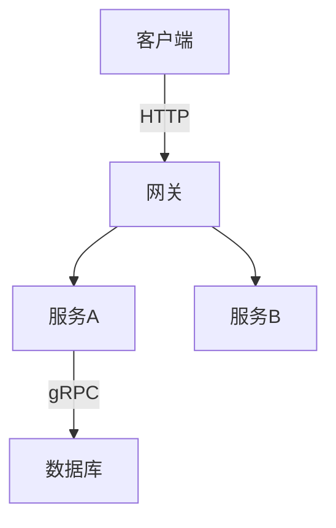

# 笔记写作规范

> 本文档定义 note 知识库的目录结构、README 模板、命名规范与图表约定，方便后续维护与扩展。

---

## 1. 目录结构规范

### 1.1 顶层模块（note/）

每个模块使用 `{nn}.{英文主题}/` 格式，`nn` 为两位数编号：

```
note/
├── 01.java/
├── 02.computer-basics/
├── 03.database/
├── ...
└── 13.split-hairs/
```

**规则：**
- 编号从 01 开始，两位数字 + 点号 + 英文小写 + 短横线
- 每个模块必须有 `README.md`
- 子目录使用 `{nn}-{英文主题}/` 编号前缀（如 `01-fundamentals/`、`02-language/`）

### 1.2 模块内子目录

```
note/03.database/
├── README.md              ← 模块入口（必须有）
├── 01-fundamentals/       ← 编号前缀子目录
│   └── README.md          ← 子模块入口
├── 02-sql/
│   ├── README.md
│   └── advanced-query/    ← 深层子目录（不再编号）
│       └── README.md
```

**规则：**
- 第一层子目录：编号前缀 `{nn}-{主题}/`
- 第二层及以下：直接英文主题，无需编号

---

## 2. 模块 README 模板（8-section index template）

每个模块 `README.md` 推荐使用以下 8 段式结构（09.front-end / 10.big-data 已采用）：

```markdown
# {N}、{模块中文名}

> 一句话定位（30 字以内）

---

## 1. 模块导航

| 序号 | 主题 | 核心内容 | 子 README |
|------|------|---------|-----------|
| 01 | [主题名](dir/) | 关键词1/关键词2 | [子入口](dir/README.md) |

### 1.1 学习路径
- **新人入门**：01 → 02 → 03
- **进阶方向**：...

---

## 2. 知识脉络


---

## 3. 速查表 / Cheat Sheet

| 概念 | 解释 | 典型场景 |
|------|------|---------|

---

## 4. 核心内容（按子模块展开）

每个子模块一个段落，包含：
- 核心原理
- 关键对比 / 选型
- 代码示例（如适用）

---

## 5. 最佳实践

---

## 6. 常见面试题

---

## 7. 相关章节

- 上游：[`模块名`](../xx.module/README.md)
- 下游：[`模块名`](../xx.module/README.md)
- 关联：[`模块名`](../xx.module/README.md)

---

## 8. 开源参考（可选）

> 开源项目链接或说明
```

---

## 3. 命名规范

### 3.1 文件命名
- 使用小写英文 + 短横线：`bean-lifecycle.md`、`distributed-transaction/`
- README.md 统一大小写
- 不使用中文文件名

### 3.2 图片命名（待迁移到 Mermaid）
- 历史遗留：`img.png`、`img_1.png` 等无意义命名
- **新规范：优先使用 Mermaid 图表**
- 若必须使用图片：`{主题}-{描述}.png`，如 `bean-lifecycle-flow.png`

### 3.3 Mermaid 图表规范

**推荐类型：**
| 场景 | 推荐图表类型 |
|------|------------|
| 流程 / 步骤 | `flowchart TD` / `flowchart LR` |
| 架构 / 模块关系 | `graph TB` / `graph LR` |
| 时序交互 | `sequenceDiagram` |
| ER 关系 | `erDiagram` |
| 状态转换 | `stateDiagram-v2` |
| 类结构 | `classDiagram` |

**示例：**


---

## 4. 相关章节规范

### 4.1 相对路径规则
```markdown
<!-- 同级模块 -->
[数据库](../03.database/README.md)

<!-- 子模块 -->
[MySQL](05-mysql/README.md)

<!-- 父模块 -->
[返回总览](../README.md)

<!-- 跨模块 -->
[Spring 事务](../../06.spring/03-data/README.md)
```

### 4.2 13.split-hairs ↔ 主模块
每个 `13.split-hairs` 文章必须包含「深度阅读」链接指向主模块：
```markdown
## 相关章节
- 深度阅读：[`03.database/07-redis`](../../03.database/07-redis/README.md)
```

---

## 5. PNG → Mermaid 迁移清单

以下文件的 PNG 引用尚未迁移到 Mermaid，按优先级排列：

### 高优先级（概念图，适合 Mermaid）
| 文件 | PNG 数 | 说明 |
|------|--------|------|
| `04.system-design/01-foundation/software-engineering/development-process/` | 9 | 开发流程对比图 |
| `04.system-design/01-foundation/system-design-basics/architecture-diagram/4+1/` | 10 | 4+1 视图模型 |
| `04.system-design/01-foundation/system-design-basics/architecture-diagram/c4-model/` | 8 | C4 四层模型 |
| `04.system-design/01-foundation/technical-debt/` | 7 | 技术债流程 |
| `04.system-design/04-high-performance/mq/` | 10 | 消息队列架构 |
| `04.system-design/07-deployment/deploy/` | 4 | 部署架构 |
| `06.spring/03-data/mybatis/` | 2 | MyBatis 执行流程 |
| `05.tools/monorepo/` | 7 | Monorepo 演进 |

### 低优先级（UI 截图，不适合 Mermaid）
| 文件 | PNG 数 | 说明 |
|------|--------|------|
| `11.ai/training/lesson9/` | 21 | Dify/Coze 教程截图 |
| `11.ai/training/lesson1/` | 7 | 课程截图 |
| `11.ai/training/lesson13/` | 1 | 占位截图 |

---

## 6. Commit 规范

使用 Conventional Commits 格式：

```
feat(note): 03.database - 新增云数据库子模块 README
fix(note): 09.front-end - 修正 3 处断链
refactor(note): 04.system-design - PNG→Mermaid 迁移
docs(note): 统一模块 README 为 8-section 模板
```

类型：`feat` / `fix` / `refactor` / `docs` / `chore`

---

## 7. CI 检查

| 检查项 | 工具 | 触发条件 |
|--------|------|---------|
| 链接有效性 | `github-action-markdown-link-check` | Push/PR/Weekly |
| Stats 卡片更新 | `github-readme-stats-action` | 每日 00:00 |

配置文件：`.mlc_config.json`（忽略 Gitee/GitHub 等外链）
