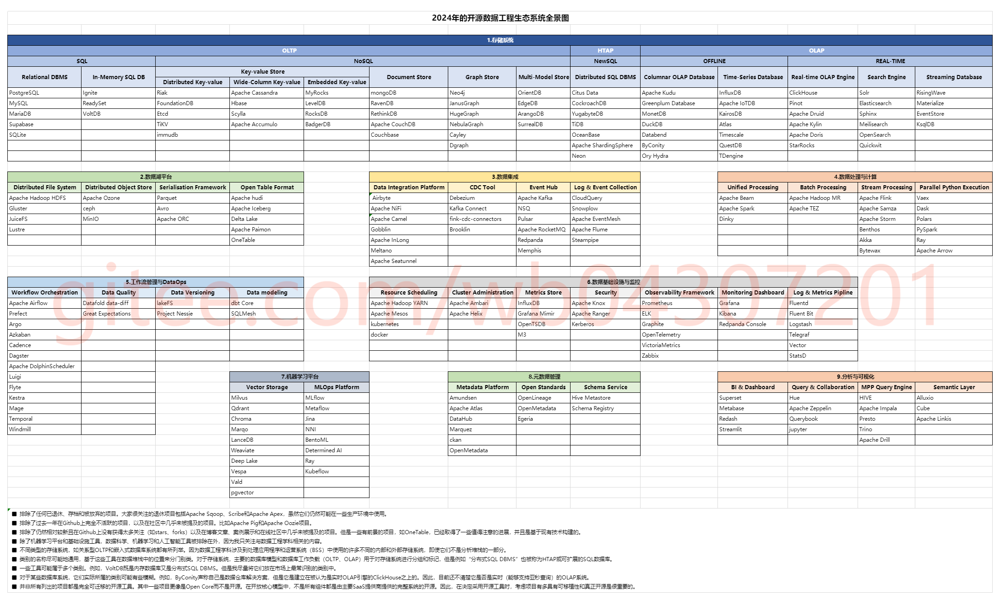
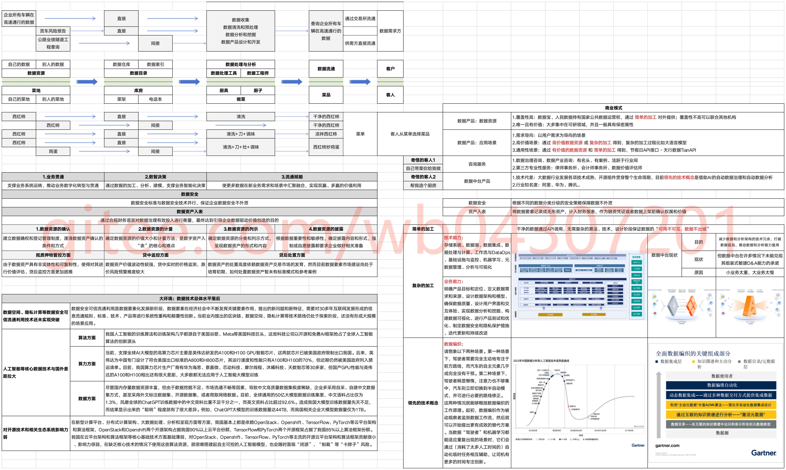

# 笔记

## 代码示例
1. 使用[文档在线预览](https://gitee.com/wb04307201/file-preview-spring-boot-starter)、[多平台文件存储](https://gitee.com/wb04307201/file-storage-spring-boot-starter)、[实体SQL工具](https://gitee.com/wb04307201/sql-util)实现的[文件预览Demo](https://gitee.com/wb04307201/file-preview-demo)
2. 使用[文档在线预览](https://gitee.com/wb04307201/file-preview-spring-boot-starter)、[多平台文件存储](https://gitee.com/wb04307201/file-storage-spring-boot-starter)、[实体SQL工具](https://gitee.com/wb04307201/sql-util)实现的[文件预览VUE Demo](https://gitee.com/wb04307201/file-preview-vue)
3. 使用[多平台文件存储](https://gitee.com/wb04307201/file-storage-spring-boot-starter)、[实体SQL工具](https://gitee.com/wb04307201/sql-util)实现的[文件存储Demo](https://gitee.com/wb04307201/file-storage-demo)
4. 使用[动态编译工具](https://gitee.com/wb04307201/loader-util)实现的[动态编译工具示例代码](https://gitee.com/wb04307201/loader-util-test)
5. 使用[Spring任务调度](https://gitee.com/wb04307201/dynamic-schedule-spring-boot-starter)、[消息中间件](https://gitee.com/wb04307201/message-spring-boot-starter)、[动态编译工具](https://gitee.com/wb04307201/loader-util)、[实体SQL工具](https://gitee.com/wb04307201/sql-util)实现的[在线编码、动态调度、发送钉钉群消息、快速构造web页面Demo](https://gitee.com/wb04307201/dynamic-schedule-demo)
6. 使用[消息中间件](https://gitee.com/wb04307201/message-spring-boot-starter)、[实体SQL工具](https://gitee.com/wb04307201/sql-util)实现的[消息发送代码示例](https://gitee.com/wb04307201/message-demo)
7. 使用[实体SQL工具](https://gitee.com/wb04307201/sql-util)实现的[实体SQL工具Demo](https://gitee.com/wb04307201/sql-util-demo)
8. 使用[易智Spring](https://gitee.com/wb04307201/easy-ai-spring-boot-starter)实现的[AI大模型Demo](https://gitee.com/wb04307201/easy-ai-demo)

## 

## 

## 

## 

## 

## 美化git
1. [Shields.io](https://github.com/badges/shields)
2. [Repo-Roster](https://github.com/nastyox/Repo-Roster)
3. [github-readme-stats](https://github.com/anuraghazra/github-readme-stats)
