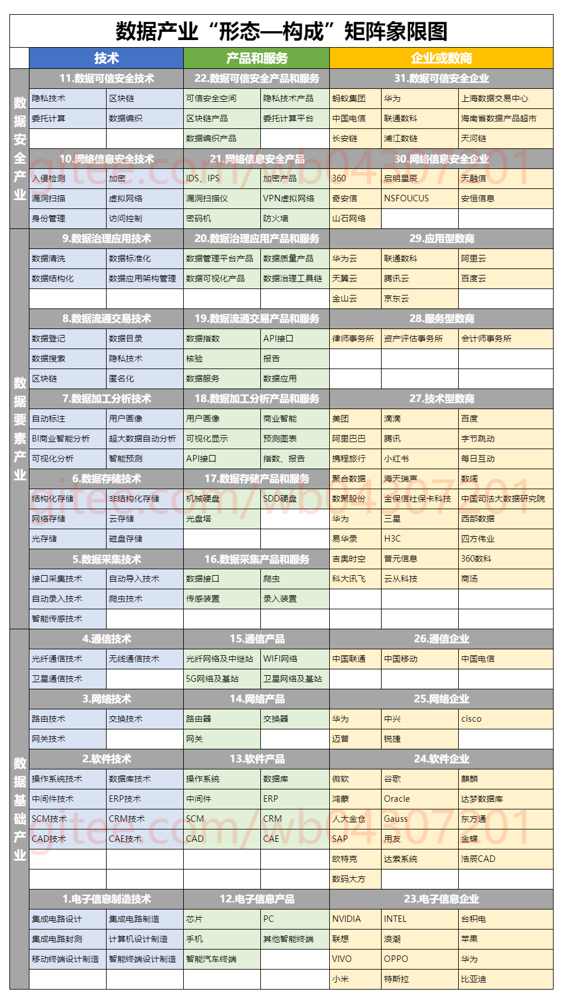
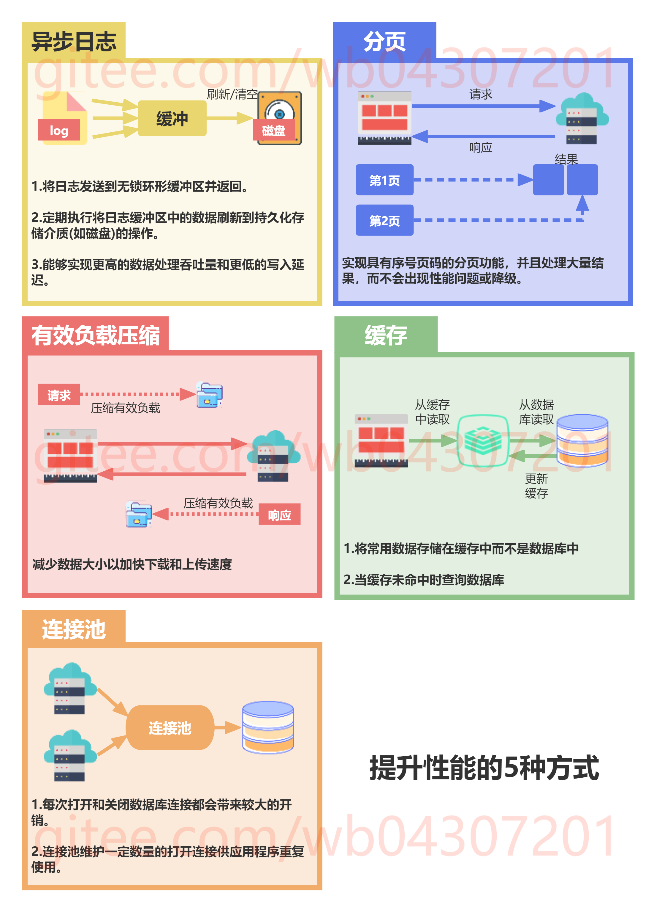

# 笔记

## 

## 

## 

## 

## 

## 美化git
1. [Shields.io](https://github.com/badges/shields)
2. [Repo-Roster](https://github.com/nastyox/Repo-Roster)
3. [github-readme-stats](https://github.com/anuraghazra/github-readme-stats)
