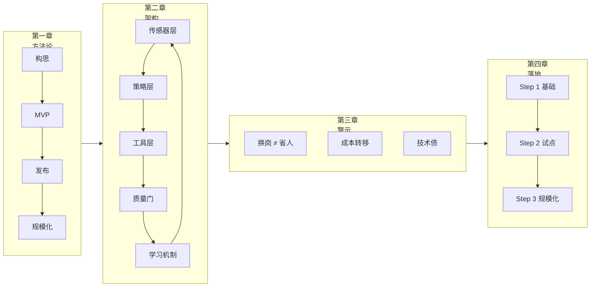

<!--
module:
  parent: ai
  slug: ai/lesson-15
  type: article
  category: 主模块子文章
  summary: 第 15 课 AI 原生组织
-->

# 第 15 课：AI 原生组织——从工具到组织架构

> **创始人手册 × 自进化公司 × 组织变革** —— AI 不只改变开发方式，更在重塑组织形态。

---
## 引言：变更说明

第 15 课：AI 原生组织——从工具到组织架构 是 4 个章节的合集。

本篇按主题归类，给出每个条目的一句话定位 + 适用版本/场景，**先扫一遍再决定读哪节**。

---

## 学习目标

学完本课后，你将能够：

- 掌握 Anthropic 提出的 AI 原生初创公司四阶段框架（构思→MVP→发布→规模化），理解每个阶段的 AI 实践方法
- 理解 YC 提出的"递归自进化智能体循环"五层架构，认识公司从层级结构到智能体网络的范式转变
- 辨识"AI 换岗不裁员"的管理逻辑，避免盲目裁员带来的技术债和组织能力退化
- 掌握 Anthropic 企业 AI 转型三步法（基础→试点→规模化），为已成立企业设计系统化转型路线
- 设计让公司运作"对 AI 可读"的信息架构，为智能体驱动的自动化奠定基础
- 重新定位人类在 AI 原生组织中的角色：从执行者到边界守护者

## 前置条件

- 前置课程：[第 14 课：AI 时代的认知债务与深度工作](../lesson14/README.md)
- 知识准备：理解 AI Agent 的核心架构和多智能体协同模式
- 推荐阅读：[第 6 课：多智能体协同](../lesson6/README.md)、[第 8 课：Agent 设计模式与架构](../lesson8/README.md)

## 核心概念速查

```text
AI 原生组织的三个层次：
  ├── 工具层：用 AI 加速个人工作（Copilot 模式）
  ├── 流程层：用智能体工作流替代人工运营（Agentic Workflow）
  └── 组织层：将公司重塑为递归自进化的智能体网络（AI Native）

创始人角色的转变：
  个人贡献者（写代码/做设计）→ 编排者（调度 AI + 聚焦战略）
```

## 章节导航

| 章节 | 文件 | 核心问题 | 建议时长 |
|:----:|:-----|:---------|:--------:|
| 第一章 | [Anthropic 创始人手册](README1.md) | AI 原生初创公司的四个生命周期阶段是什么？ | 25 min |
| 第二章 | [递归自进化的智能体循环](README2.md) | 如何构建一个在创始人睡觉时自我优化的公司？ | 30 min |
| 第三章 | [AI 换岗不裁员](README3.md) | 为什么真正重度使用 AI 的公司一个员工都没裁？ | 20 min |
| 第四章 | [企业 AI 转型指南](README4.md) | 已成立企业如何按"基础→试点→规模化"系统化推进？ | 25 min |

### 推荐阅读顺序

```
第一章（方法论框架）  →  第二章（架构愿景）  →  第三章（管理警示）  →  第四章（落地路径）
     ↑                       ↑                      ↑                      ↑
  怎么做？             终极形态是什么？        什么不能做？         已成立企业怎么转？
```

- **快速了解**：先读第二章 + 第三章（约 50 分钟），理解 AI 原生组织的机遇与陷阱
- **创始人/管理者**：通读全部四章；初创者重点看第一章，企业负责人重点看第四章
- **技术负责人**：重点阅读第二章的五层循环架构 + 第四章的平台化与 Playbook 化

---

## 核心架构图



---

> 🚀 从 [第一章：Anthropic 创始人手册](README1.md) 开始 | ⬅️ [返回课程总目录](../README.md)

> 💼 企业负责人推荐：[第四章：企业 AI 转型指南](README4.md)

---

⬅️ 上一课：[AI 时代的认知债务与深度工作](../lesson14/README.md) | ➡️ 下一课：[LLM 驱动的个人知识库](../lesson16/README.md)

---

## 📎 附件

| 文件 | 说明 |
|:-----|:-----|
| [The-Founders-Playbook.pdf](The-Founders-Playbook.pdf) | Anthropic 创始人手册原文 |
| [The Enterprise AI Transformation Guide.pdf](The%20Enterprise%20AI%20Transformation%20Guide.pdf) | 企业 AI 转型指南原文 |

---

← [返回 AI Agent 应用开发培训课程](../README.md)
