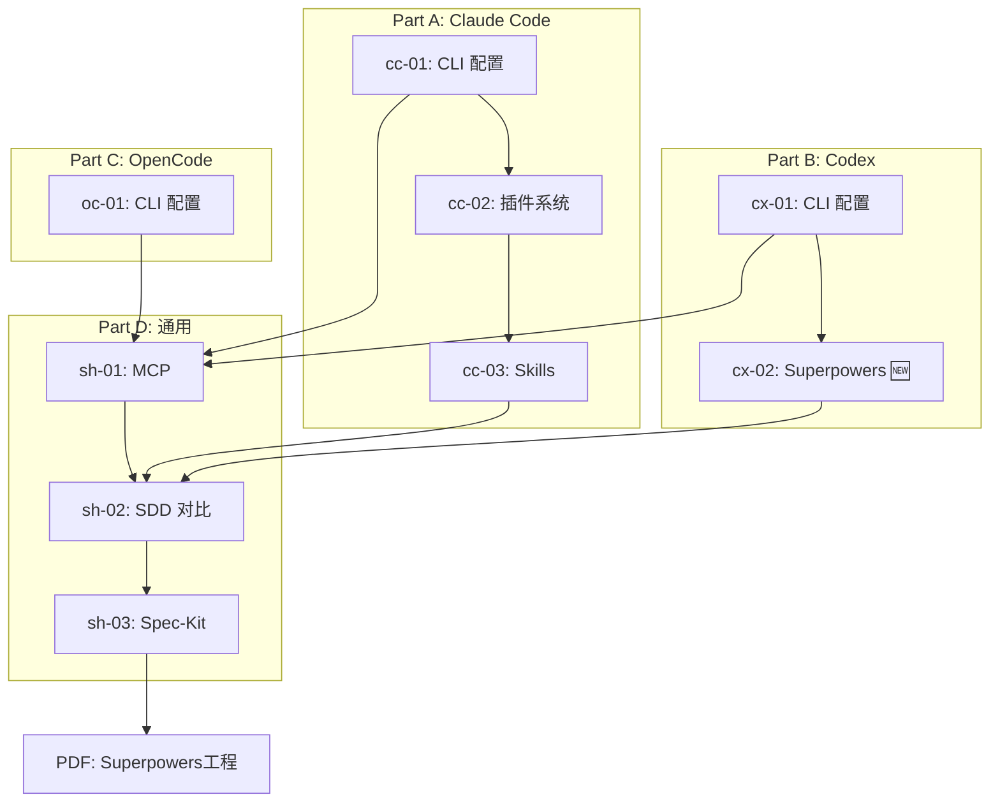

<!--
module:
  parent: ai
  slug: ai/lesson-07
  type: article
  category: 主模块子文章
  summary: 第 7 课 Claude Code 工具链
-->

# 第 7 课：Claude Code 工具链

⬅️ [返回课程总目录](../README.md)

> **CLI 配置 × MCP 生态 × 插件系统 × Skills × 规范驱动开发** —— 掌握 AI 辅助开发的完整工具链。  
> 本课从环境配置到规范驱动开发，系统讲解 Claude Code 的全流程工程实践。

---
## 引言：变更说明

第 7 课：Claude Code 工具链 是 9 个章节的合集。

本篇按主题归类，给出每个条目的一句话定位 + 适用版本/场景，**先扫一遍再决定读哪节**。

---

## 学习目标

学完本课后，你将能够：

- 完成 Claude Code CLI 的安装与阿里云百炼平台模型配置
- 理解 MCP 协议生态，按需组合 MCP 服务器
- 掌握 Claude Code 插件系统与 Skills 技能体系
- 了解 Spec-Kit、Kiro、OpenSpec 三大规范驱动开发工具的选型与使用

---

## 章节导航

### Part A：Claude Code

| 章节 | 文件 | 核心问题 | 建议时长 |
|:----:|:-----|:---------|:--------:|
| A-01 | [Claude Code CLI 配置指南](cc-01-cli.md) | 如何搭建 Claude Code 开发环境？ | 30 min |
| A-02 | [Claude Code 插件系统](cc-02-plugins.md) | 插件如何提升效率？ | 30 min |
| A-03 | [Claude Code Skills 深度解析](cc-03-skills.md) | Skills 如何组织和使用？ | 30 min |

### Part B：Codex

| 章节 | 文件 | 核心问题 | 建议时长 |
|:----:|:-----|:---------|:--------:|
| B-01 | [Codex CLI 配置指南](cx-01-cli.md) | OpenAI Codex 如何配置百炼？ | 20 min |
| B-02 | [Codex Superpowers 安装与使用](cx-02-superpowers.md) | 🆕 Codex 如何安装和使用 Superpowers？ | 30 min |

### Part C：OpenCode

| 章节 | 文件 | 核心问题 | 建议时长 |
|:----:|:-----|:---------|:--------:|
| C-01 | [OpenCode CLI 配置指南](oc-01-cli.md) | OpenCode 如何配置百炼？ | 20 min |

### Part D：通用主题

| 章节 | 文件 | 核心问题 | 建议时长 |
|:----:|:-----|:---------|:--------:|
| D-01 | [MCP 推荐](sh-01-mcp.md) | 哪些 MCP 服务器值得用？ | 30 min |
| D-02 | [规范驱动开发工具对比](sh-02-sdd.md) | 三大 SDD 工具如何选型？ | 40 min |
| D-03 | [Spec-Kit 使用说明](sh-03-speckit.md) | Spec-Kit 工作流如何落地？ | 40 min |
| 补充 | [实战 Harness 工程 (PDF)](实战Harness工程 V1.4.pdf) | Superpowers 实战案例 | 20 min |

---

本课程系统讲解 AI 辅助开发的完整工具链与工程实践，涵盖从环境配置到规范驱动开发的全流程。

---

## 🗂️ 文档索引

### Part A：Claude Code

#### [cc-01-cli.md](cc-01-cli.md) - Claude Code CLI 配置指南
- **核心内容**：Claude Code 安装与阿里云百炼平台模型 API 配置
- **关键知识点**：Node.js 安装、百炼模型配置（千问全系列）、MCP 工具集成、Windows 环境依赖、插件与 Skills 入口

#### [cc-02-plugins.md](cc-02-plugins.md) - Claude Code 插件系统
- **核心内容**：官方与社区插件生态详解
- **官方热门**：`superpowers` / `frontend-design` / `code-review` / `security-audit` / `test-assistant` / `git-flow`
- **社区精选**：docker-helper / api-docs-gen / tailwind-studio / db-schema-sync 等

#### [cc-03-skills.md](cc-03-skills.md) - Claude Code Skills 深度解析
- **核心内容**：Skills 系统架构与热门技能推荐
- **技术要点**：config.yaml + prompt.md + scripts/ + tools.json 结构，安装与管理命令
- **热门分类**：开发提效 / 代码质量 / 框架专精 / 运维文档 / 高阶扩展

### Part B：Codex

#### [cx-01-cli.md](cx-01-cli.md) - Codex CLI 配置指南
- **核心内容**：OpenAI Codex CLI 安装与百炼模型配置
- **关键知识点**：`~/.codex/config.toml`（TOML）、Responses API vs Chat API、MCP 集成、常见问题排查

#### [cx-02-superpowers.md](cx-02-superpowers.md) - 🆕 Codex Superpowers 安装与使用
- **核心内容**：在 Codex 中安装和使用 Superpowers 技能体系
- **关键知识点**：Superpowers 适配差异、AGENTS.md 配置、Skills 目录结构、常用技能实战

### Part C：OpenCode

#### [oc-01-cli.md](oc-01-cli.md) - OpenCode CLI 配置指南
- **核心内容**：OpenCode CLI 安装与百炼模型配置
- **关键知识点**：`opencode.json`（JSON）、Anthropic 兼容 API、思考模式、MCP 集成

### Part D：通用主题

#### [sh-01-mcp.md](sh-01-mcp.md) - MCP（Model Context Protocol）推荐
- **核心内容**：MCP 协议生态与热门服务器推荐（适用所有 Agent）
- **分类清单**：综合资源库 / 信息检索 / 思维增强 / 开发调试 / 数据知识库 / 部署云服务
- **场景化组合**：实时研究写作、前端开发调试、自动化任务流等 5 大场景推荐

#### [sh-02-sdd.md](sh-02-sdd.md) - 规范驱动开发工具深度对比
- **核心内容**：Spec-Kit / Kiro / OpenSpec 三大工具横向评测
- **选型决策树**：企业级新项目 → Spec-Kit；个人快速原型 → Kiro；遗留系统维护 → OpenSpec

#### [sh-03-speckit.md](sh-03-speckit.md) - Spec-Kit 规范驱动开发（SDD）工具包
- **核心内容**：GitHub 官方 Spec-Kit 完整使用指南（5 步法 + 辅助命令 + 最佳实践）
- **工作流程**：Constitution → Specify → Plan → Tasks → Implement

#### [实战Harness工程 V1.4.pdf](实战Harness工程 V1.4.pdf)
- **补充资料**：Superpowers 实战工程案例（从第 5 页开始）

---

## 🎯 学习路径建议

### 推荐学习顺序

按你使用的 Agent 选择对应 Part 开始：

| Agent | 学习路径 |
|-------|---------|
| **Claude Code** | Part A（cc-01 → cc-02 → cc-03）→ Part D（sh-01 → sh-02 → sh-03）→ PDF |
| **Codex** | Part B（cx-01 → cx-02）→ Part D（sh-01 → sh-02 → sh-03）→ PDF |
| **OpenCode** | Part C（oc-01）→ Part D（sh-01 → sh-02 → sh-03）→ PDF |
| **全部了解** | Part A → Part B → Part C → Part D → PDF |

---

## 🔑 核心价值主张

> **让开发者聚焦"做什么"，让 AI 专注"怎么做"**

- ✅ **可控性**：规格先行，输出可预期，告别概率生成的随机性
- ✅ **可维护性**：规范约束，团队友好，代码风格统一
- ✅ **安全性**：变更审计，风险可控，生产环境更可靠
- ✅ **工程化**：融入现有开发流程，非黑盒魔法

---

## 📖 外部资源

- 🌐 [Claude Code 官方文档](https://docs.anthropic.com/claude-code)
- 🔧 [阿里云百炼 Claude Code 配置指南](https://help.aliyun.com/zh/model-studio/claude-code)
- 🔧 [阿里云百炼 Codex 配置指南](https://help.aliyun.com/zh/model-studio/codex)
- 🔧 [阿里云百炼 OpenCode 配置指南](https://help.aliyun.com/zh/model-studio/opencode)
- 💬 [Chatbox AI 客户端（支持 Qwen 等 API）](https://chatboxai.app/zh)
- 📦 [MCP 服务器注册表](https://mcp.so)
- 🎬 [Spec-Kit 视频概览](https://github.io/spec-kit/video-overview)  <!-- 链接需核实 -->

---

⬅️ [上一课：多智能体协同](../lesson6/README.md) | ➡️ [下一课：AI Agent 设计模式与架构](../lesson8/README.md)

---

← [返回 AI Agent 应用开发培训课程](../README.md)